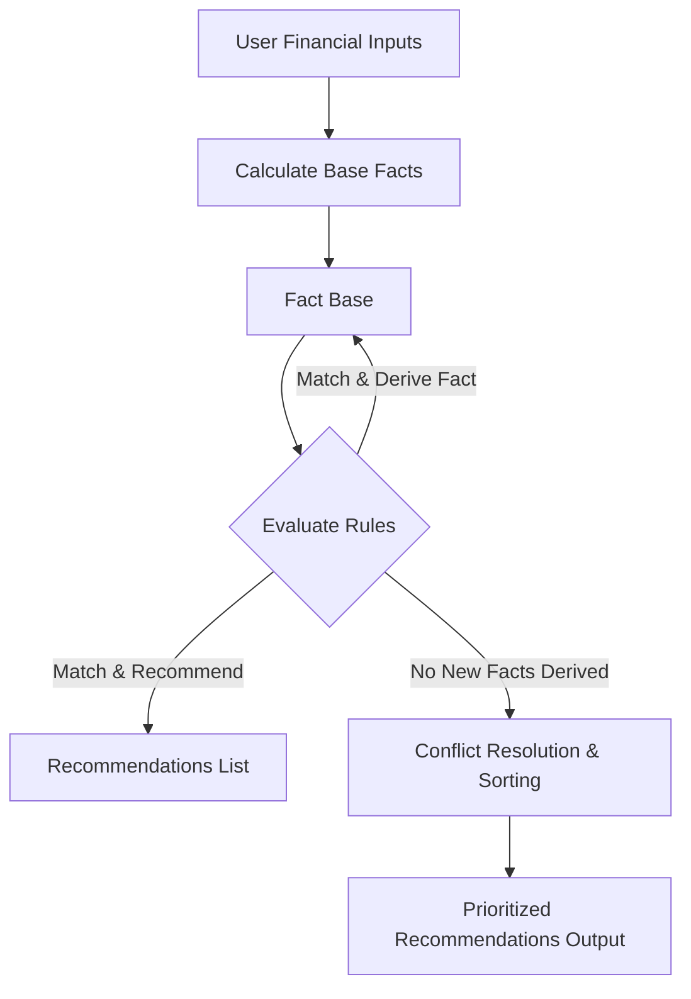

# Personal Finance Advisor - Knowledge-Based System (KBS)

A comprehensive, rule-based expert system implemented in Python that analyzes a user's financial profile and generates tailored advisory recommendations. It provides an interactive Command-Line Interface (CLI), a modern Flask Web Graphical User Interface (GUI), and a dedicated Knowledge Acquisition interface.

---

## 1. Problem Statement
Personal financial management can be complex and overwhelming. Many individuals struggle with fundamental questions:
* Am I saving enough?
* Should I invest or pay off debt first?
* How large should my emergency fund be?
* What asset allocation suits my risk tolerance and time horizon?

This **Personal Finance Advisor KBS** addresses these challenges by acting as a virtual financial planner. By gathering structured inputs (income, expenses, emergency funds, debt, risk tolerance, and investment horizon), the system applies standard financial planning benchmarks to evaluate the user's financial health, flag critical risks (like deficits or high-interest debt), and provide actionable, prioritized recommendations.

---

## 2. Knowledge Acquisition Process
The knowledge base was constructed using standard financial planning guidelines:
* **The 50/30/20 Rule**: Allocating 50% of net income to Needs (essentials), 30% to Wants (discretionary), and 20% to Savings or debt paydown.
* **Emergency Fund Benchmarks**: Maintaining a liquid reserve covering at least 3 months of essential expenses for stable income earners, and 6 months for unstable/variable earners.
* **Debt-to-Income (DTI) Thresholds**: A DTI ratio below 36-40% is considered healthy; anything above 40% represents critical financial vulnerability.
* **Debt Paydown Priority**: High-interest debt (>7% interest rate) should be aggressively paid down (Avalanche/Snowball method) before routing extra capital to long-term investments.
* **Investment Asset Allocation**: Portfolios (Conservative, Balanced, Aggressive) matched against risk tolerance and investment time horizons.

### Knowledge Acquisition Module (`acquisition.py`)
To enable expansion of the system, we implemented a dedicated knowledge acquisition pipeline. It includes validation algorithms that enforce consistency:
1. **Syntax Checking**: Ensures every rule contains mandatory elements (`id`, `if`, `then`, `category`, `description`) and valid logical conditions.
2. **Duplicate Detection**: Verifies that the rule ID and logical contents are unique.
3. **Circular Dependency Checking**: Translates rule derivations into a directed fact dependency graph. It runs a Depth-First Search (DFS) cycle-detection algorithm to ensure no rules form logical loops (e.g., Rule 1 derives Fact A from Fact B, and Rule 2 derives Fact B from Fact A), which would crash the inference engine.

---

## 3. Knowledge Representation
The knowledge base is stored externally in [knowledge_base.json](file:///c:/Users/miche/Documents/GitHub/Mmicheni-/knowledge_base.json). It separates financial threshold constants from production rules.

### Production Rules Schema
Rules support:
* **Single conditions** (fact comparison)
* **Compound logical conditions** (`and`, `or`, `not`)
* **Two actions**:
  1. `derive`: Sets a new intermediate fact in the fact base (allowing multi-step reasoning).
  2. `recommend`: Logs a recommendation with a priority (`critical`, `high`, `medium`, `low`) and dynamic message interpolation (substituting actual user figures into the advice).

*Example Rule (Deriving a fact):*
```json
{
  "id": "derive_ready_to_invest",
  "category": "Investment",
  "description": "Determine if user is ready to invest",
  "if": {
    "and": [
      {"fact": "has_adequate_emergency_fund", "operator": "==", "value": true},
      {"fact": "has_high_interest_debt", "operator": "!=", "value": true}
    ]
  },
  "then": {
    "action": "derive",
    "fact": "ready_to_invest",
    "value": true
  }
}
```

---

## 4. Inference Strategy
The system uses a custom **Forward-Chaining Inference Engine** implemented in [engine.py](file:///c:/Users/miche/Documents/GitHub/Mmicheni-/engine.py). 



### Steps in the Forward-Chaining Loop:
1. **Fact Base Initialization**: Gathers raw inputs and computes base metrics (e.g. savings rate, emergency fund months, DTI percentage).
2. **Rule Matching & Cycles**: The engine cycles through the rules. If a rule's conditions match the current fact base:
   * If the action is `derive`, it updates the fact base. The engine notes that facts have changed, forcing another evaluation cycle.
   * If the action is `recommend`, it stores the recommendation message, dynamically formatting it with the user's specific values.
3. **Termination**: The process repeats until a cycle passes with no new facts derived, preventing infinite loops.
4. **Explanation Tracing**: The engine records every rule activation, capturing the cycle number, matched conditions, and action taken, showing exactly *how* recommendations were reached.
5. **Conflict Resolution**: Fired recommendations are sorted by priority (`critical` > `high` > `medium` > `low`) for presentation.

---

## 5. Installation & Usage Instructions

### Prerequisites
* Python 3.8 or higher.
* Flask (for the Web GUI).

### Setup
1. Clone the repository and navigate to the project directory:
   ```bash
   git clone <repo_url>
   cd Simple-Rule-Based-Systems
   ```
2. Install the required packages:
   ```bash
   pip install -r requirements.txt
   ```

### Execution
You can run the system through the unified entrypoint [main.py](file:///c:/Users/miche/Documents/GitHub/Mmicheni-/main.py):

* **Interactive CLI Mode**:
  ```bash
  python main.py --cli
  ```
  Guides you through a series of terminal prompts and displays diagnostics and recommendations, along with an optional reasoning path trace.

* **Flask Web GUI Mode**:
  ```bash
  python main.py --gui
  ```
  Launches a local Flask web server and automatically opens the dashboard in your default browser, providing input sliders, KPI cards, dynamic Chart.js visualizations, and an integrated rule manager.

* **Knowledge Acquisition Mode**:
  ```bash
  python main.py --acquire
  ```
  Starts the CLI rule builder to append new rules directly to `knowledge_base.json` after running syntax and dependency checks.

### Running Tests
Execute the unit tests to verify the correctness of the engine and validation logic:
```bash
python -m unittest tests/test_engine.py
```
